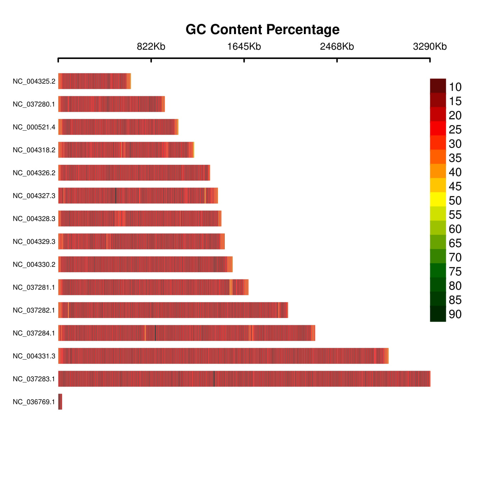
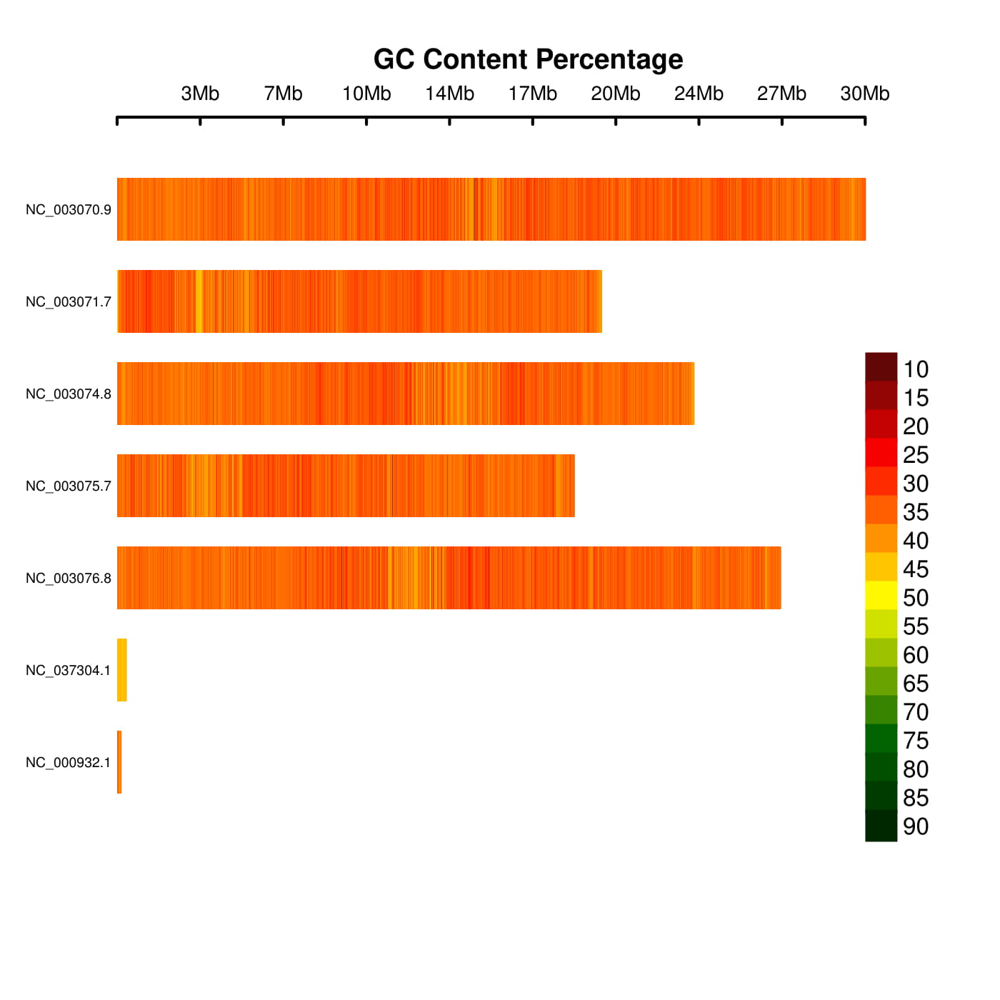
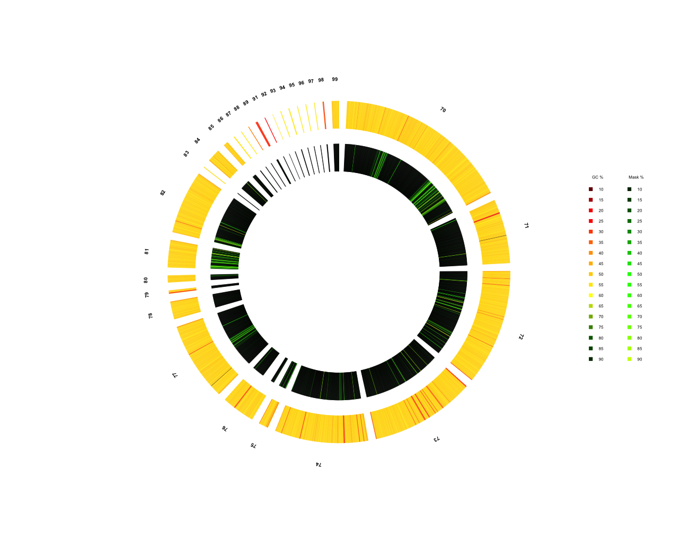

gc_plotter
=========

## Simple tool to map GC bins on chromosome ideograms with existing tools

Inspired by (and code taken from) [CMplot](https://github.com/YinLiLin/R-CMplot)
<br>
The Unix commands for creating GC content tracks also have been taken from [here](https://wiki.bits.vib.be/index.php/Create_a_GC_content_track)

---

### Run

#### You must have bedtools, samtools and basic unix utils installed

Simply change the script to executable

```bash
chmod 755 gc.sh
```

#### Linux
Change the script from #!/bin/bash to /usr/bin/bash or appropriate shell. 

Then run the script with 2 arguments, first is the reference genome fasta and the second is the desired width to scan for GC percenatge. 
```bash
./gc /home/reference.fasta 1000
```
The following files will be created in the directory which has the reference genome:

".sizes" &nbsp;&nbsp;&nbsp; file which specifies all the chromosomes/scaffolds and the lengths in basepairs <br>
".bed"   &nbsp;&nbsp;&nbsp;&nbsp;&nbsp;  bed file <br>
".fai"   &nbsp;&nbsp;&nbsp;&nbsp;&nbsp;&nbsp;&nbsp;  fasta index from samtools <br>
".igv"   &nbsp;&nbsp;&nbsp;&nbsp;&nbsp;&nbsp; igv viewer file with positions, bins, and gc content. Output file needed for gc_plotter<br>

---

### Plots

Two simple examples are the plasmodium species *P. falciparum* and *P. knowlesi*

*P. falsiparum* is well-known as a very [AT rich](https://genomevolution.org/wiki/index.php/Plasmodia_comparative_genomics) and GC poor genome. While *P. knowlesi* is still AT rich, but much less rich than *falciparum*. We can plot these and see if we get the expected results.

The genomes were downloaded from [ncbi](https://www.ncbi.nlm.nih.gov/genome/?term=txid1245013[Organism:noexp]) and used as is, except for a renaming. 

```bash
./gc.sh /home/plasmodium_knowlesi_genomic.fna 10000 d jpg
```
<p align="center">
<a href="https://raw.githubusercontent.com/TheRincon/gc_plotter/figures/plas1.jpg">

</a>
</p>

---
Same for the second genome:

```bash
./gc.sh /home/plasodium_falciparum_genomic.fna 10000 d jpg
```
<p align="center">
<a href="https://raw.githubusercontent.com/TheRincon/gc_plotter/figures/plas.jpg">

</a>
</p>

As we can see, there is lots of red for *falciparum* indicating that yes, it seems to be well within the 20's (23%), and *knowlesi* is around 40% as expected. 

---

We can also try a slightly larger genome to see if it scales:

```bash
./gc.sh /home/arabidopsis_thaliana_genomic.fna 10000 d jpg
```

<p align="center">
<a href="https://raw.githubusercontent.com/TheRincon/gc_plotter/figures/arabidopsis.jpg">

</a>
</p>

---

### Circular Plot

I have now added circular plots. It has an extended command on the terminal taking a hard-masked fasta. If you have a soft-masked fasta ("atcg" instead of "ATCG") then please run the "mask.py" script.

```python
python mask.py soft-masked.fasta
```

The full command line for the circular plot:
```bash
./gc.sh /home/knufia.genome.fasta 10000 c /home/Desktop/knufia.hard_masked.fasta
```
This will then genrate something like this:

<p align="center">
<a href="https://raw.githubusercontent.com/TheRincon/gc_plotter/figures/knufia_circ.png">

</a>
</p>

The figure above is purposefully enlarged to show the small contigs. Normally, the spacing will not be so explicit on the legend. 

---

### Hints

The legend can be freely changed in the linear plot, simply replace "topright" or "bottomright" on the last line in gcplot.r to another location or coordinates. The colors can easily be changed within the Rscript under col (or col2 in case of the circular plot). 

If grey boxes appear in the plot, the bin is probably too high (around 50k or over is seems to fail). It will require modification, as I usually work with fungal genomes of about 15-100Mb, so it is optimized for this range. 

The title must be changed by hand in the plot Rscript. It will be under paste("..."), just search for this string in the file. 

---

### To Do

1. Make the legend more "publication worthy", as it looks very simple now. 
2. Add "title" option. User should be able to pass an argument. 
3. Gene density plots? 
