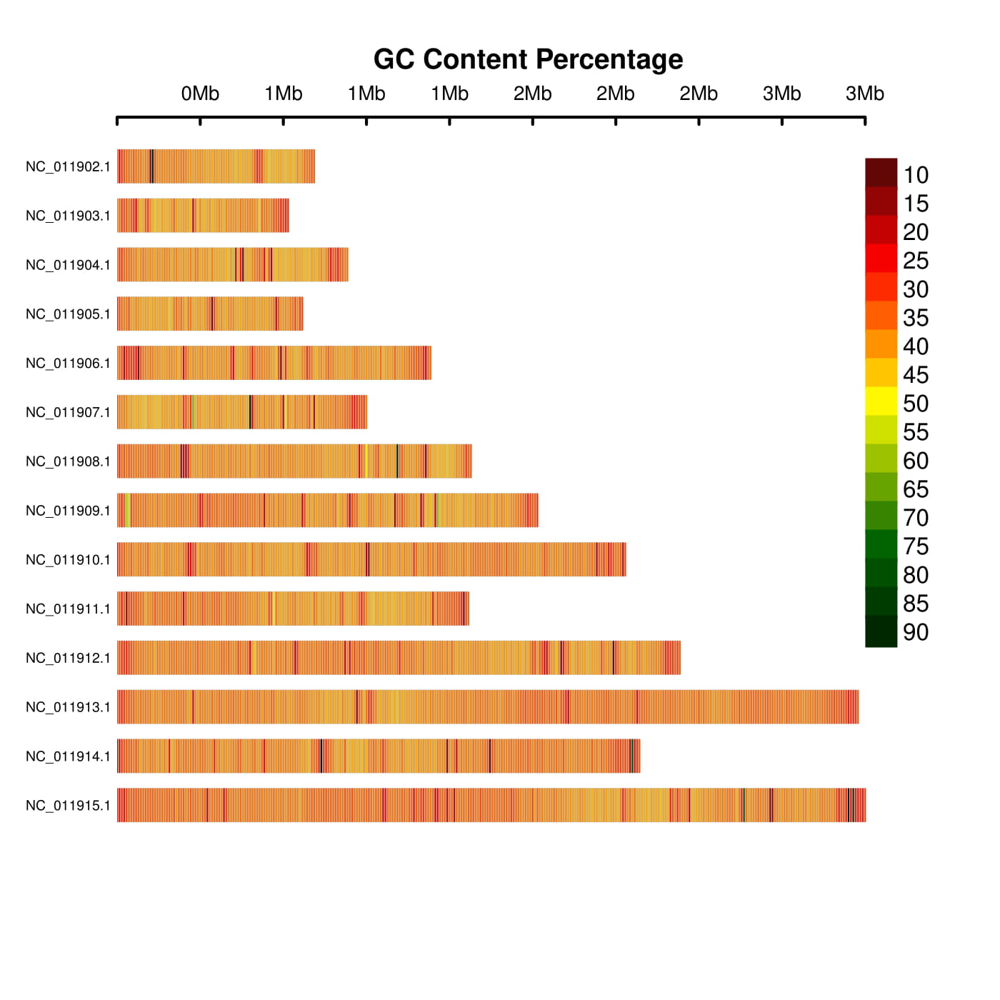

gc_plotter
=========

## Simple tool to map GC content on ideograms for chromosomes or contigs.\

Inspired by CMplot (with some code used)[CMplot](https://github.com/YinLiLin/R-CMplot)
<br>
The Unix commands for creating GC content tracks also have been taken from [here](https://wiki.bits.vib.be/index.php/Create_a_GC_content_track)

---

### Run

Simply change the script to executable

```bash
chmod 755 gc.sh
```

Then run the script with 2 arguments, first is the reference genome fasta and the second is the desired width. 
```bash
./gc /home/reference.fasta 1000
```

---

### Plots

Two simple examples are the plasmodium species *P. falciparum* and *P. knowlesi*

*P. falsiparum* is well-known as very AT and GC poor. While *P. knowlesi* is still AT rich, but much less rich than the falciparum. We can plot these and see if we get the expected results.

```bash
./gc.sh /home/plasmodium_knowlesi_genomic.fna 10000
```
<p align="center">
<a href="https://raw.githubusercontent.com/TheRincon/gc_plotter/plas1.jpg">

</a>
</p>


```bash
./gc.sh /home/plasodium_falciparum_genomic.fna 10000
```
<p align="center">
<a href="https://raw.githubusercontent.com/TheRincon/gc_plotter/plas.jpg">

</a>
</p>

---

### Hints

The legend can be freely changed, simply replace "topright" or "bottomright" on the last line in gcplot.r to another location or coordinates. 

If grey boxes appear in the plot, the bin is probably too high. It will require modification, as I usually work with fungal genomes in the range of 15-100Mb, so it optimized for that. 
